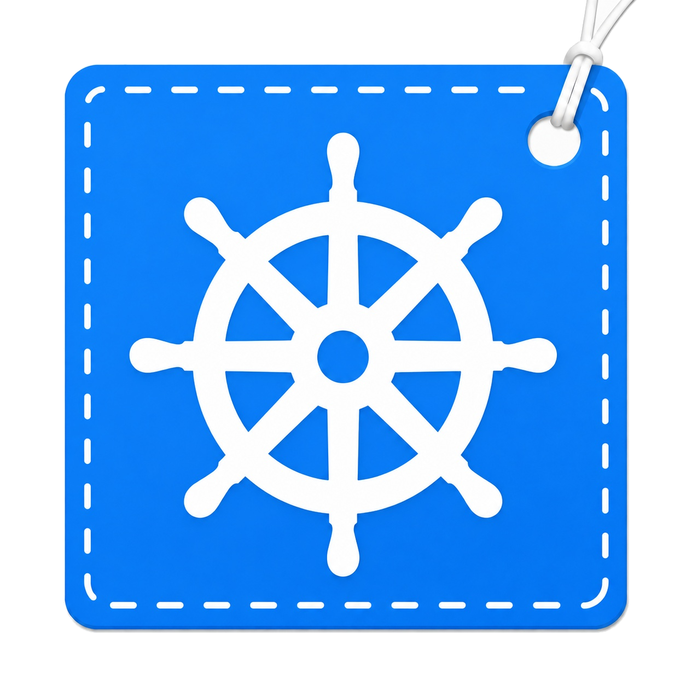

<h1>&nbsp;KubeTag</h1>

KubeTag classifies Kubernetes GitHub issues and proposes labels from the
`kind/*`, `sig/*`, and `area/*` taxonomies. It runs as a stateless GitHub
Actions workflow, uses a fine-tuned DeBERTa model for multi-label
classification, and can apply selected labels through a GitHub App token.

The workflow is configured for dry-run operation by default. Predictions are
logged, but labels are not written until live mode is explicitly enabled.

## How it works

```text
GitHub issue event
        |
        v
Canonical text cleaning
        |
        v
512-token head-tail encoding
        |
        v
DeBERTa-v3-large classifier
        |
        v
Taxonomy-specific thresholds
        |
        v
Dry-run output or GitHub label update
```

Text cleaning removes existing taxonomy labels, triage commands, quoted
commands, HTML noise, raw URLs, and issue references. Long issues retain 70%
of their token budget from the beginning and 30% from the end. Training and
runtime inference use the same `kubetag-text-v3` preprocessing contract.

## Model evaluation

The dataset contains human-applied labels from closed Kubernetes issues. It is
split chronologically by issue group to prevent related issues from crossing
split boundaries.

| Split | Rows | Use |
|---|---:|---|
| Train | 6,979 | Model fitting |
| Validation | 1,395 | Model and threshold selection |
| Lockbox | 941 | Reserved final evaluation |

The primary selection metric is validation micro-F1. All numbers below are
validation results; the lockbox is not used for model selection.

| Model | Evaluation | Micro-F1 |
|---|---|---:|
| ModernBERT-base | Single run | 73.85% |
| ELECTRA-large | Single run | 74.96% |
| TF-IDF + logistic regression | Single run | 75.06% |
| ModernBERT-large, 512 tokens | Single run | 77.64% |
| ModernBERT-large, 1,024 tokens | Single run | 78.16% |
| RoBERTa-large | Three-seed mean | 78.99% |
| DeBERTa-v3-large | Three-seed mean | **79.22%** |
| DeBERTa-v3-large, selected run | Best epoch 9 | **79.82%** |

The controlled three-seed comparison used the same data, preprocessing, loss,
maximum length, threshold selection, and evaluation code.

| Seed | DeBERTa-v3-large | RoBERTa-large |
|---:|---:|---:|
| 7 | 78.75% | 78.64% |
| 42 | 79.20% | 79.09% |
| 123 | 79.72% | 79.23% |
| Mean | **79.22%** | 78.99% |

DeBERTa won the primary metric at every matched seed. RoBERTa produced a
slightly higher mean macro-F1 and exact-match score, but DeBERTa was selected
because micro-F1 was declared as the primary metric before comparison.

The selected DeBERTa checkpoint reports:

| Metric | Validation result |
|---|---:|
| Micro-F1 | 79.82% |
| Macro-F1 | 54.87% |
| Micro precision | 83.51% |
| Micro recall | 76.45% |
| Exact match | 47.67% |
| TF-IDF micro-F1 improvement | +4.77 percentage points |

## Repository structure

```text
artifacts/model/          Versioned model metadata; large weights are ignored
src/kubetag/
  application.py         Prediction and label-application orchestration
  config.py              Environment configuration
  github/                 Event parsing and GitHub API client
  inference/              Artifact loading, predictors, and postprocessing
  text_processing.py      Shared training/runtime text contract
tests/                    Unit and CLI integration tests
.github/workflows/        Safe dry-run GitHub Actions workflow
```

## Local setup

KubeTag requires Python 3.12 and [uv](https://docs.astral.sh/uv/).

```powershell
uv sync --extra model
```

The model bundle is too large for regular Git. Download it from its Hugging
Face repository or place it manually in `artifacts/model`.

```powershell
$env:KUBETAG_MODEL_REPOSITORY = "owner/kubetag-deberta-v3-large"
$env:KUBETAG_MODEL_REVISION = "MODEL_COMMIT_SHA"
$env:MODEL_DIR = "artifacts/model"
uv run --extra model kubetag-download-model
```

`HF_TOKEN` is only required when the model repository is private.

## Test a current issue

Set the transformer backend and run a read-only prediction for any public
GitHub issue:

```powershell
$env:PREDICTOR_BACKEND = "transformer"
$env:MODEL_DIR = "artifacts/model"
uv run --extra model kubetag --dry-run --issue kubernetes/kubernetes#123456
```

A token is optional for public issues and increases the GitHub API rate limit:

```powershell
$env:GITHUB_TOKEN = "YOUR_TOKEN"
```

Raw text can also be tested without a GitHub request:

```powershell
uv run --extra model kubetag --dry-run `
  --title "Kubelet fails after node restart" `
  --body "The node becomes NotReady and pods remain pending."
```

The **Issue Triage** workflow can run the same read-only check from the
Actions tab. Choose **Run workflow** and enter an issue as
`kubernetes/kubernetes#123456`. Manual checks do not require the GitHub App
token, but they do require the configured model repository.

## Run the tests

```powershell
uv sync
uv run pytest
uv run ruff check .
uv run mypy src
```

The base test suite does not load the large transformer. A local transformer
smoke test requires the `model` extra and a complete model bundle.

## GitHub Actions configuration

For automated issue events, configure `KUBETAG_APP_CLIENT_ID` as a repository
variable and `KUBETAG_APP_PRIVATE_KEY` as a secret. The workflow uses the model
repository settings from local setup and starts in owner-only dry-run mode.

## License

This project is available under the [Apache License 2.0](LICENSE).
