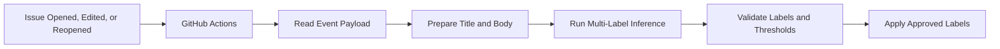
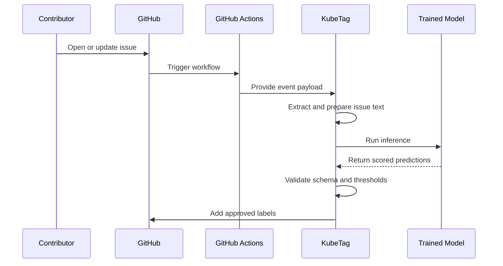

#  KubeTag

**ML-powered Kubernetes issue labeling for `kind/*`, `sig/*`, and `area/*` taxonomies.**

KubeTag analyzes the title and description of a GitHub issue, predicts the most relevant Kubernetes labels, validates them against an approved schema, and applies the selected labels directly to the issue.

It is designed as a lightweight, stateless workflow that runs through GitHub Actions without requiring an always-on server.

## Problem

Large open-source repositories receive many issues that must be manually categorized before the correct maintainers can act on them.

In Kubernetes, this usually involves assigning labels such as:

- `kind/*` for the issue type
- `sig/*` for the responsible Special Interest Group
- `area/*` for the affected technical area

Manual triage is repetitive, time-consuming, and can be inconsistent across similar issues.

KubeTag turns unstructured issue text into validated, reviewable label decisions.

## How It Works



Each workflow run processes one issue event.

KubeTag does not create suggestion comments. It directly adds labels that pass validation and confidence thresholds.

## Labeling Behaviour

KubeTag follows a conservative label-application policy:

- only approved `kind/*`, `sig/*`, and `area/*` labels can be applied
- every prediction must pass its saved per-label threshold
- unknown labels are rejected
- existing human-assigned labels are preserved
- KubeTag never removes labels
- duplicate labels are ignored
- if no prediction passes its threshold, no GitHub write is performed

Example result:

```text
kind/bug
sig/node
area/kubelet
```

## System Design



The application is stateless:

- GitHub stores the issue and its labels
- GitHub Actions provides the execution environment
- the trained model is loaded from the repository artifacts
- no database, queue, or external API server is required

## Model Scope

KubeTag performs multi-label classification across three taxonomies:

| Taxonomy | Purpose | Example |
|---|---|---|
| `kind/*` | Identifies the issue type | `kind/bug` |
| `sig/*` | Identifies the responsible SIG | `sig/node` |
| `area/*` | Identifies the affected component | `area/kubelet` |

A single issue may receive labels from more than one taxonomy.

## Repository Structure

```text
kubetag/
├── .github/
│   └── workflows/
│       └── issue-triage.yml
├── artifacts/
│   └── model/
│       ├── label_schema.json
│       ├── thresholds.json
│       ├── model_manifest.json
│       └── model files
├── src/
│   └── kubetag/
│       ├── __init__.py
│       ├── __main__.py
│       ├── application.py
│       ├── config.py
│       ├── domain.py
│       ├── logging_config.py
│       ├── text_processing.py
│       ├── github/
│       │   ├── __init__.py
│       │   ├── events.py
│       │   ├── client.py
│       │   └── labels.py
│       └── inference/
│           ├── __init__.py
│           ├── base.py
│           ├── development.py
│           ├── factory.py
│           └── postprocessing.py
├── tests/
│   ├── fixtures/
│   ├── unit/
│   └── integration/
├── training/
├── pyproject.toml
├── uv.lock
└── README.md
```

## Technology

- Python 3.12
- GitHub Actions
- `uv` for dependency management
- `httpx` for GitHub API communication
- `pytest` for testing
- Ruff for linting and formatting
- mypy for static type checking

The final inference backend can use either:

- a transformer model such as ModernBERT or DeBERTa
- a classical TF-IDF and Linear SVC pipeline

The rest of the application is independent of the selected model.

## Local Development

### Requirements

- Python 3.12
- `uv`
- Git

### Install dependencies

```bash
uv sync
```

### Run quality checks

```bash
uv run ruff check .
uv run ruff format --check .
uv run mypy src
uv run pytest
```

### Run a local dry test

```bash
uv run python -m kubetag \
  --event-file tests/fixtures/issue_opened.json \
  --dry-run
```

Dry-run mode executes the complete pipeline but prints the labels that would be applied instead of calling the GitHub API.

Example:

```text
Repository: example/repository
Issue: #42
Model: kubetag-development-v1

Labels selected:
- kind/bug
- sig/node
- area/kubelet

Dry run complete. No labels were applied.
```

## GitHub Actions Workflow

The workflow runs for:

```yaml
on:
  issues:
    types:
      - opened
      - edited
      - reopened
```

Required permissions:

```yaml
permissions:
  contents: read
  issues: write
```

KubeTag uses the built-in `GITHUB_TOKEN`. No custom token is required for normal repository execution.

Workflow concurrency should be grouped by repository and issue number so that repeated edits do not process the same issue simultaneously.

## Prediction Contract

The inference layer returns a typed result:

```json
{
  "model_version": "kubetag-modernbert-v1",
  "backend": "transformer",
  "inference_duration_ms": 184,
  "predictions": [
    {
      "label": "kind/bug",
      "taxonomy": "kind",
      "score": 0.94,
      "threshold": 0.63,
      "selected": true
    },
    {
      "label": "sig/node",
      "taxonomy": "sig",
      "score": 0.87,
      "threshold": 0.71,
      "selected": true
    }
  ]
}
```

Only predictions with `selected: true` and a label present in `label_schema.json` are allowed to reach the GitHub API.

## Model Artifacts

The final model is loaded from:

```text
artifacts/model/
```

Required metadata:

```text
label_schema.json
thresholds.json
model_manifest.json
```

`label_schema.json` defines the exact supported labels and their taxonomies.

`thresholds.json` stores the validated decision threshold for each label.

`model_manifest.json` records:

```text
model_name
model_version
backend
trained_at
max_length
labels
artifact_format
```

Transformer exports may additionally contain:

```text
model.safetensors
config.json
tokenizer.json
tokenizer_config.json
```

A classical model export may contain:

```text
pipeline.joblib
```

## Model Selection

The training pipeline is expected to compare:

- TF-IDF with Complement Naive Bayes
- TF-IDF with One-vs-Rest Logistic Regression
- TF-IDF with One-vs-Rest Linear SVC
- ModernBERT-base
- DeBERTa-v3-base

The final model should be selected using both predictive quality and CPU inference cost.

## Evaluation

The final report will include:

- Micro F1
- Macro F1
- Weighted F1
- Precision@3
- Recall@3
- Hamming loss
- Exact-match ratio
- Per-label precision, recall, and F1
- Taxonomy-wise F1
- CPU inference latency
- Model size

Evaluation results will be added after training and validation are complete.

## Reliability and Safety

KubeTag is designed to fail safely.

- malformed event payloads stop execution
- pull-request payloads are ignored
- unsupported actions are ignored
- missing issue bodies are handled as empty text
- unknown labels are rejected
- low-confidence predictions are ignored
- API failures return a non-zero exit status
- temporary network failures use bounded retries
- partial or unvalidated predictions are never applied
- existing labels are never removed

## Current Status

| Component | Status |
|---|---|
| Dataset collection and validation | In progress |
| Classical baseline training | Planned |
| Transformer training | Planned |
| GitHub event processing | In development |
| Label application workflow | In development |
| Real model integration | Pending model selection |
| Final evaluation results | Pending |

No model-performance claims are made until the final evaluation is complete.

## Roadmap

1. Finalize the verified Kubernetes issue dataset
2. Train and compare baseline and transformer models
3. Select the best model for CPU inference
4. Export the model, label schema, thresholds, and manifest
5. Integrate the real inference backend
6. Complete the GitHub label-application workflow
7. Add model metrics and latency benchmarks
8. Validate behaviour on controlled test issues
9. Enable the workflow on the target repository

## GitHub App Setup

To run KubeTag under its own bot identity (e.g. `kubetag[bot]`) and authenticate securely, you must configure a GitHub App:

1. **Register the GitHub App:**
   - Go to your GitHub Settings > **Developer settings** > **GitHub Apps** > **New GitHub App**.
   - Set a unique name (e.g., `KubeTag` or another unique name).
   - Set the Homepage URL to your repository URL.
   - **Disable Webhooks:** Uncheck the "Active" checkbox under the Webhooks section (GitHub Actions will supply the issue event payload).

2. **Configure Permissions:**
   - Under **Repository permissions**, grant:
     - **Issues:** Read & write (required to apply labels directly).
     - **Metadata:** Read-only (default requirement).
   - Under **Where can this GitHub App be installed?**, select **Only on this account**.

3. **Install the App:**
   - Click **Install App** in the sidebar and install it on the target repository.

4. **Generate Credentials & Secrets:**
   - Copy the **Client ID** / **App ID** from the App overview page. Store it as a GitHub Repository Variable named `KUBETAG_APP_CLIENT_ID`.
   - Scroll down to the **Private keys** section and click **Generate a private key**. This downloads a `.pem` file.
   - Store the complete contents of this `.pem` private key as a GitHub Repository Secret named `KUBETAG_APP_PRIVATE_KEY`.
   - **Security Warning:** Never commit the `.pem` private key file to git (it is ignored automatically via `.gitignore`).

5. **Runtime Authentication:**
   - During each workflow execution, the workflow generates a short-lived installation access token using the App credentials.
   - All labeling actions on issues will appear under the registered App identity (e.g., `kubetag[bot]`).

## Motivation

KubeTag is intended to reduce repetitive issue-triage work and improve consistency while preserving maintainer control.

The system does not remove labels or overwrite human decisions. It only adds validated labels when the model has sufficient confidence.

